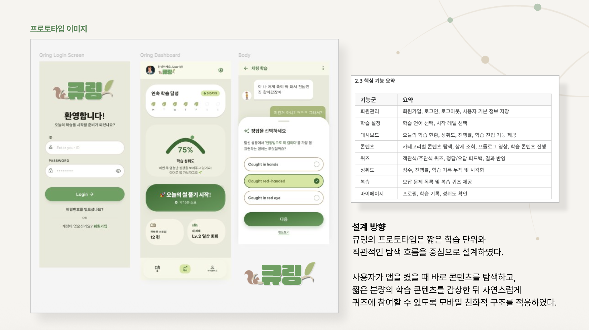
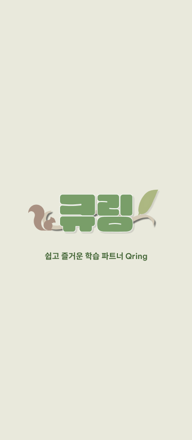
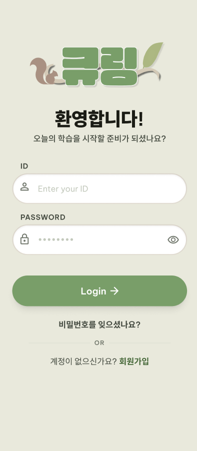
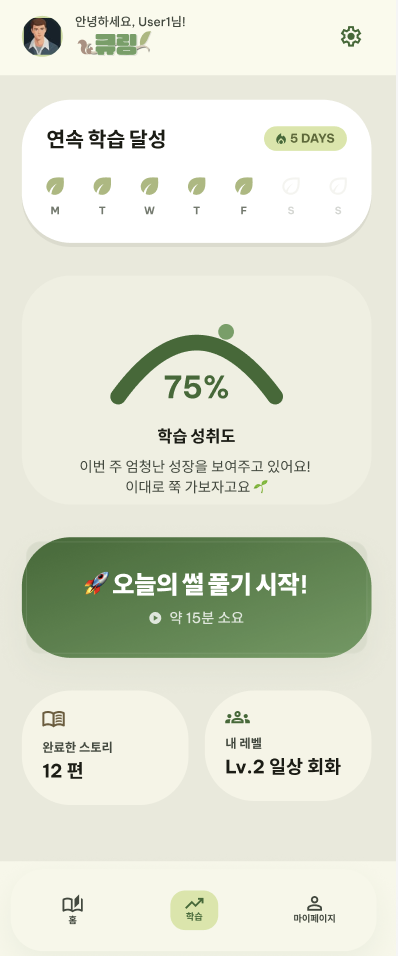
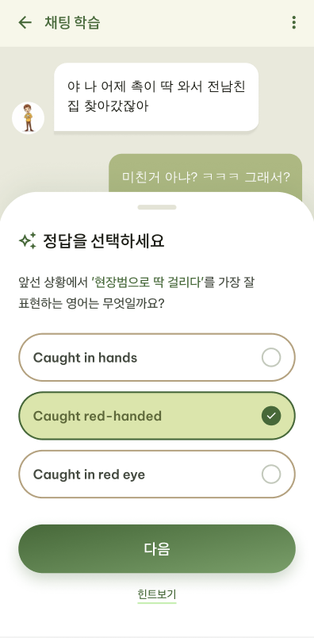
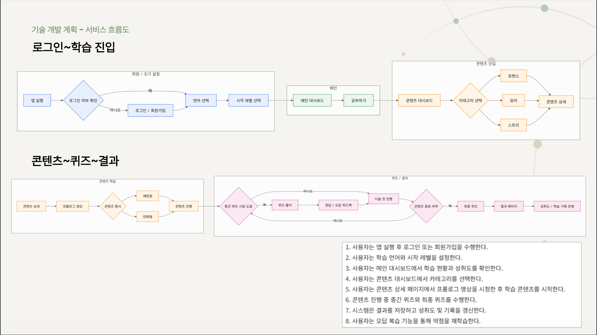
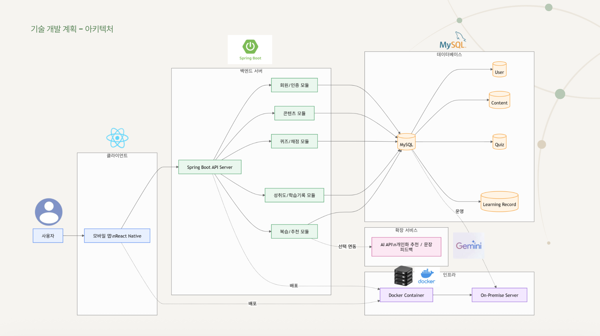

# 🍃 큐링 (Q-Language)
**스토리 콘텐츠 기반 인터랙티브 언어학습 앱 서비스**

## 📖 개요
"영어를 잘 하고 싶지만, 영어 공부는 하기 싫은 당신을 위해"

**큐링(Q-Language)** 은 학습 부담을 줄이기 위해 채팅형 및 만화형 콘텐츠 감상 중간에 퀴즈를 삽입하는 구조의 모바일 영어학습 앱입니다. 사용자가 '공부를 시작한다'는 압박감보다 '재미있는 콘텐츠를 본다'는 감각으로 자연스럽게 학습에 접근할 수 있도록 설계되었습니다.

### ✨ 주요 특징
* **콘텐츠 주도 학습:** 지루한 암기나 과제 지향적 방식에서 벗어나, 숏폼(웹툰, 채팅형 썰툰) 스토리를 즐기며 실용 표현을 학습합니다.
* **게이미피케이션:** 게임처럼 즐길 수 있는 UI/UX를 통해 학습 장벽을 낮추고 지속성과 동기를 부여합니다.
* **맞춤형 퀴즈 및 피드백:** 콘텐츠 시청 중 퀴즈(객관식/주관식)를 풀고 즉각적인 결과 피드백을 받아 성취도를 높입니다.

---

## 💡 기획 및 프로토타입
앱의 전반적인 설계 방향과 핵심 기능 요약입니다. 짧은 학습 단위와 직관적인 탐색 흐름을 중심으로 설계하였습니다.

  

### 📱 상세 화면
<table align="center">
  <tr align="center">
    <td><b>초기 화면</b></td>
    <td><b>로그인 화면</b></td>
  </tr>
  <tr align="center">
    <td></td>
    <td></td>
  </tr>
  <tr align="center">
    <td><b>대시보드 화면</b></td>
    <td><b>학습 및 퀴즈 화면</b></td>
  </tr>
  <tr align="center">
    <td></td>
    <td></td>
  </tr>
</table>

---

## 🔄 서비스 흐름도 (User Flow)
사용자가 앱을 실행하고 학습을 완료하기까지의 전체적인 서비스 흐름입니다.

  

---

## 🛠 기술 스택
* **Frontend:** React Native
* **Backend:** Java, Spring Boot
* **Database:** MySQL
* **Infra:** Docker, On-Premise Server
* **Collaboration:** GitHub, Figma

## 🏗 시스템 아키텍처
클라이언트 요청부터 데이터베이스 처리, 인프라 배포까지의 전체 시스템 구성도입니다.

  

---

## 👨‍💻 팀 구성 (팀 큐링)
* **박수현 (팀장):** Frontend 리더 / UI·UX 설계
* **김영우:** Frontend / 콘텐츠 / 게이미피케이션 로직
* **김하늘:** Frontend 상태 관리 / PM / 문서 & 디자인
* **임태형:** Infra / 도커 환경 구성 / 성능 최적화
* **채다현:** Backend / DB 설계 / API 개발

---

## ⚙️ 프로그램 설치 가이드
*(추후 완성)*

---

## ▶️ 실행 가이드
*(추후 완성)*
