# 🍃 큐링 (Qring)
> **스토리 콘텐츠 기반 영어 회화 언어학습 앱 서비스**

  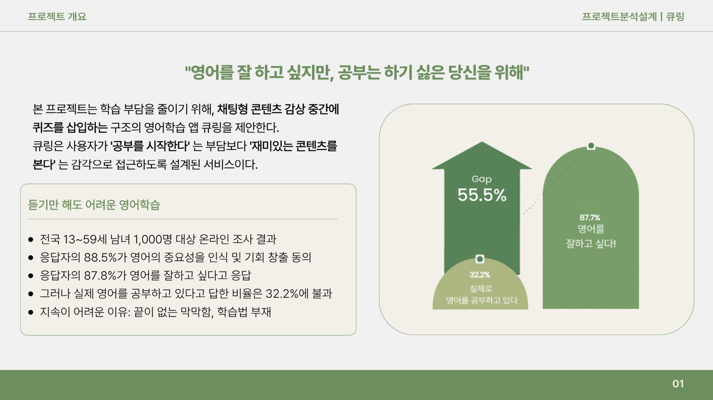

## 📖 개요
> "영어를 잘 하고 싶지만, 공부는 하기 싫은 당신을 위해"

**큐링**은 학습 부담을 최소화하기 위해, **채팅형 숏폼 콘텐츠 감상 중간에 자연스럽게 퀴즈를 풀어가는 모바일 영어학습 앱**입니다. 사용자가 '공부를 시작한다'는 압박감 대신, '재미있는 콘텐츠를 소비한다'는 감각으로 매일 꾸준히 학습에 접근할 수 있도록 설계되었습니다.

---

## 🔗 서비스 분석 및 타겟

  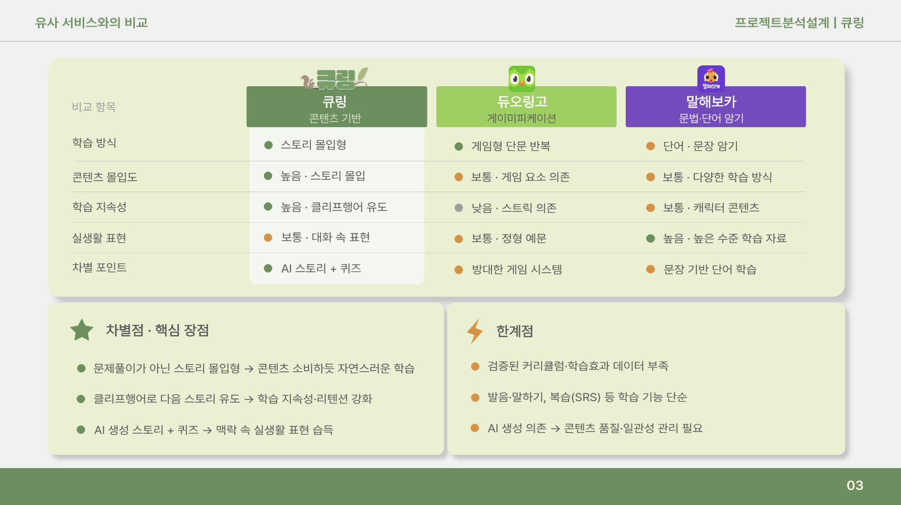

### 🎯 타겟 고객
* **핵심 타겟:** 영어 회화의 필요성은 절감하지만, 기존의 딱딱한 인터넷 강의나 문제집으로는 꾸준히 공부하기 어려운 **20대 대학생 및 직장인 입문자**.
* **사용자 특징:** 
  * 자투리 시간을 활용한 짧은 학습 단위(Short-form) 선호
  * 즉각적인 성취감 보상을 통한 동기부여 필요
  * 텍스트 위주의 메신저(채팅) 형태 UI/UX에 높은 친숙도

### ✨ 주요 특징
* **스토리 몰입형 콘텐츠:** 지루한 암기나 단순 문제풀이에서 벗어나, 웹툰이나 웹소설을 보듯 스토리 자체에 몰입하며 실생활 유용한 표현을 자연스럽게 습득합니다.
* **학습 지속성 (게이미피케이션):** 게임 요소를 접목한 UI/UX와 다음 화가 궁금해지는 '클리프행어(Cliffhanger)' 장치를 활용해 학습 장벽을 낮추고 지속적인 참여를 유도합니다.
* **맞춤형 퀴즈 및 보상:** 채팅형 콘텐츠 진행 프로세스 중 최적의 타이밍에 퀴즈가 등장하며, 결과에 따른 보상 시스템을 통해 최소 시간 대비 높은 학습 효율을 보장합니다.

---

## 💡 기획 및 프로토타입
짧은 학습 호흡과 직관적인 네비게이션을 중심으로 설계된 앱의 전반적인 구조입니다.

  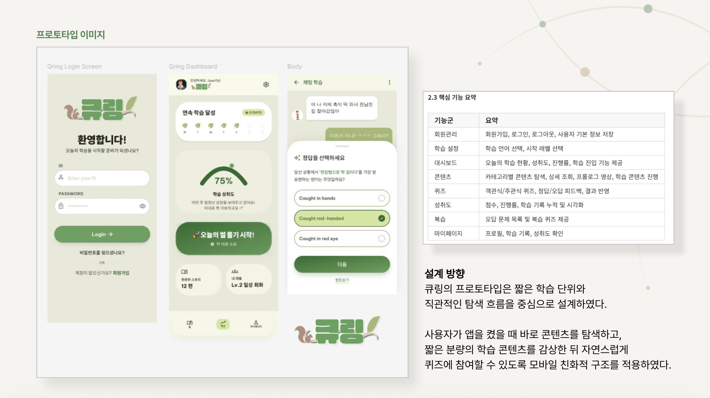

### 📱 상세 화면
<table align="center">
  <tr align="center">
    <td><b>초기 화면 (Splash)</b></td>
    <td><b>로그인 화면</b></td>
  </tr>
  <tr align="center">
    <td>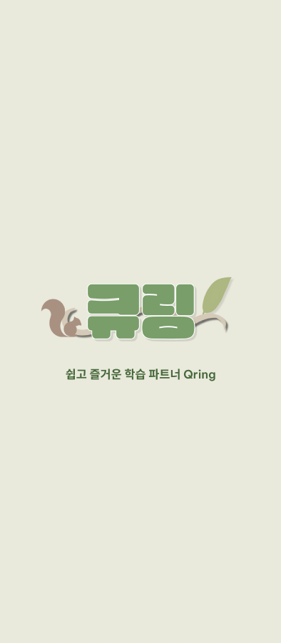</td>
    <td>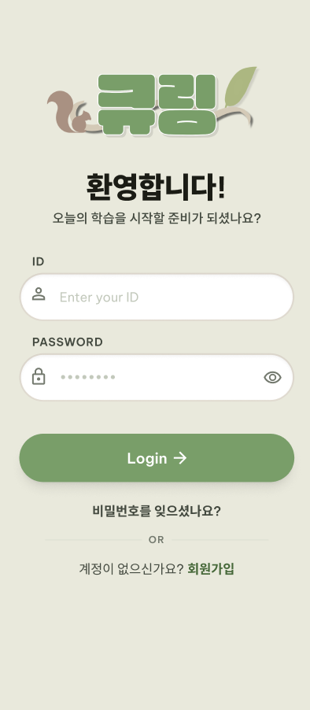</td>
  </tr>
  <tr align="center">
    <td><b>대시보드 화면</b></td>
    <td><b>학습 및 퀴즈 화면</b></td>
  </tr>
  <tr align="center">
    <td>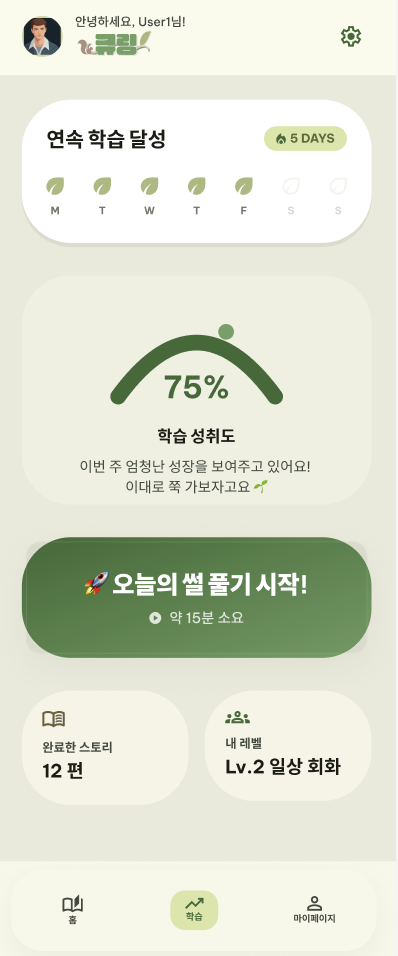</td>
    <td>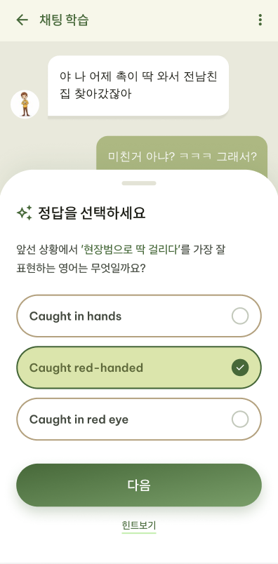</td>
  </tr>
</table>

---

## 🔄 서비스 흐름도 (User Flow)
사용자가 앱을 진입하여 콘텐츠 선택, 학습 진행, 퀴즈 풀이 및 보상 수령까지 이어지는 전체적인 유저 시나리오입니다.

  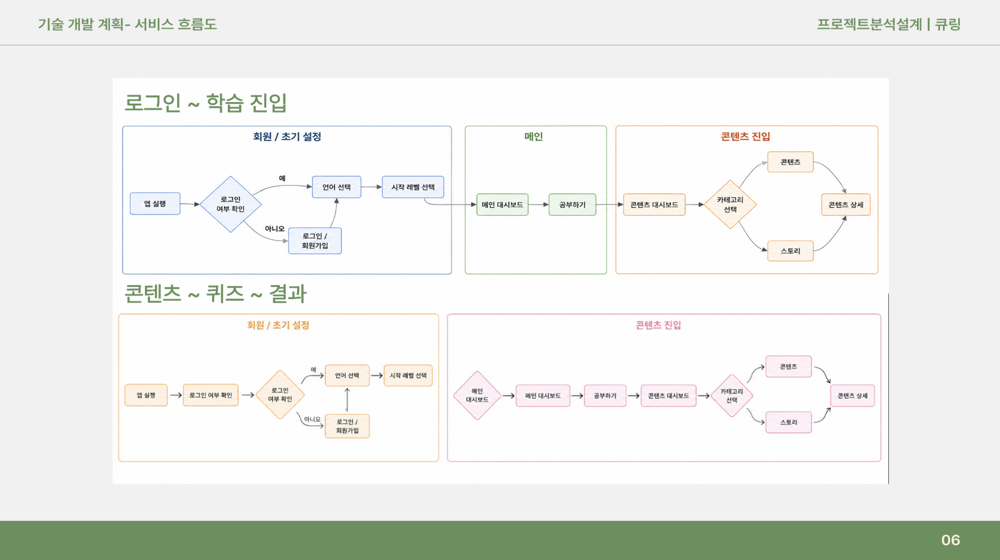

---

## 🛠 기술 스택

| 계층 | 기술 스택 | 배지 (Badge) | 역할 |
| :--- | :--- | :--- | :--- |
| **Frontend** | React Native |  | 크로스 플랫폼 모바일 UI/UX 구현, 전역 상태 관리, 네이티브 API 및 아웃바운드 API 연동 |
| **Backend** | Java, Spring Boot |     | 비즈니스 로직 처리, 회원 인증, 콘텐츠 및 게이미피케이션(퀴즈/보상) 관리 RESTful API 제공 |
| **Database** | MySQL |  | 사용자 정보, 스토리 콘텐츠 데이터, 퀴즈 및 개별 학습 이력 메타데이터 관계형 저장 |
| **Infra** | Docker, On-Premise |     | 컨테이너 기반 개발/배포 환경 표준화, 자체 서버 인프라 구축 및 안정적인 인스턴스 운영 |
| **AI (확장)** | Gemini API |  | 학습자 데이터 기반 맞춤형 콘텐츠 추천 알고리즘 및 퀴즈 문장 피드백 기능 확장 예정 |
| **Cooperation** | GitHub, Figma |     | Git Flow 기반 형상 관리 및 이슈 트래킹, 와이어프레임 설계 및 프로토타이핑 협업 |

---

## 🏗 시스템 아키텍처
클라이언트의 요청이 무중단 분산 환경 및 컨테이너 기술을 거쳐 데이터베이스까지 안전하게 도달하는 시스템 구성도입니다.

  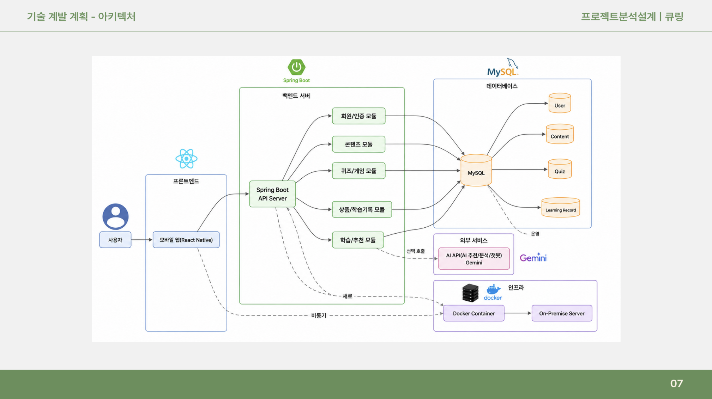

## 🧬 ERD

  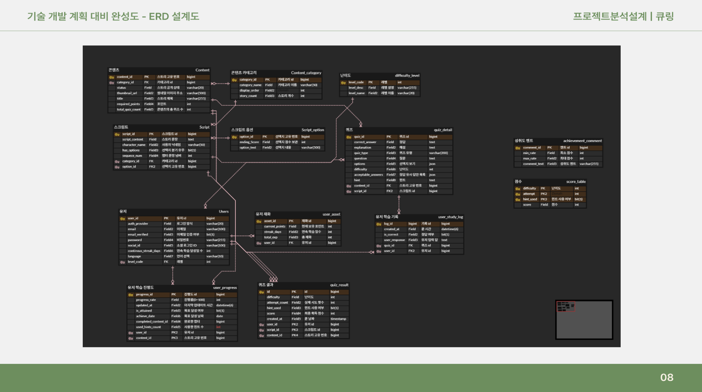

---

## 👨‍💻 팀 구성 및 역할

* **박수현 (팀장)**
  * **Role:** Frontend Developer / UI·UX Designer
  * **Work:** 서비스 기획 및 와이어프레임 설계, React Native 기반 코어 UI 프레임워크 구축, 컴포넌트 구조화 및 전반적인 개발 공정 조율
* **임태형**
  * **Role:** DevOps / Infra Engineer
  * **Work:** Docker 인프라 환경 구축, 온프레미스 서버 환경 설정, CI/CD 배포 파이프라인 설계 및 패킷/컨테이너 최적화
* **김영우**
  * **Role:** Frontend Developer / Content Feature
  * **Work:** 카테고리별 스토리 리스트 및 상세 뷰 구현, 인앱 애니메이션 효과 적용 및 게이미피케이션 요소 인터랙션 개발
* **채다현**
  * **Role:** Backend Developer / Database Administrator
  * **Work:** 도메인 데이터 모델링 및 MySQL 스키마 설계, JWT 기반 인증 프로세스 구축, 콘텐츠 및 학습 기록 인/아웃바운드 API 개발

---

## 🎬 시연 영상
<table align="center">
  <tr align="center">
    <td><b>큐링 앱 시연 화면</b></td>
  </tr>
  <tr align="center">
    <td>
      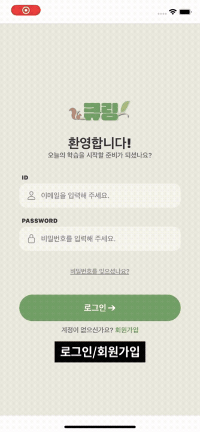
    </td>
  </tr>
</table>

---

## ⚙️ 프로그램 설치 가이드
*(추후 완성)*
